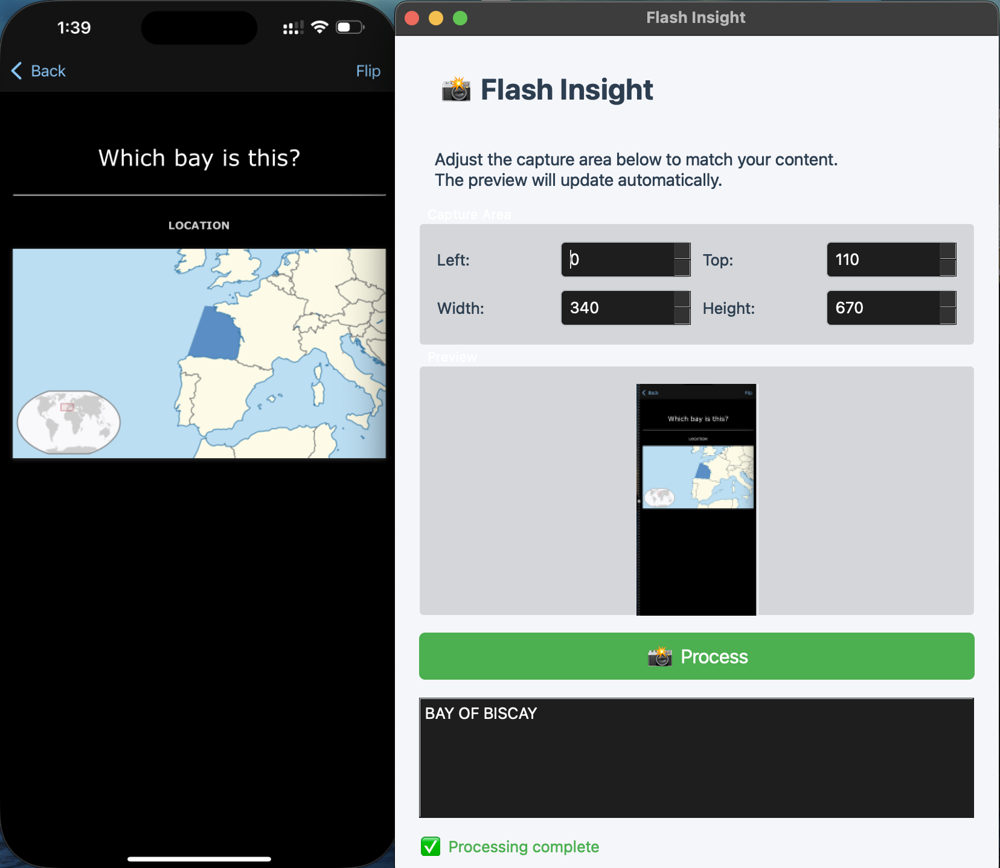

# Flash Insight

Real-time visual AI processing at your fingertips. Flash Insight instantly analyzes screen content using Google's Gemini Vision AI, providing immediate, accurate insights from any visual information.

## Overview

Flash Insight combines advanced computer vision with real-time screen capture to transform visual information into instant understanding. Built with PyQt5 and Gemini Vision AI, it offers a clean, efficient interface for rapid visual analysis.


*Flash Insight shown alongside an iPhone screen mirror, demonstrating real-time quiz analysis and answer processing.*

## Features

- Real-time preview of the selected capture area
- Adjustable screen region with manual bounds controls
- In-app Gemini model selector ranked by available daily quota
- AI-powered visual analysis for screenshots and quiz-style prompts
- Always-on-top PyQt5 interface for quick capture workflows
- Request logging for debugging model usage and quota behavior

## 🚀 Getting Started

### Prerequisites
- Python 3.8+
- Google Gemini API key (free tier available)

## Installation

1. Clone the repository
```bash
git clone https://github.com/JadAssaf/flash-insight.git
cd flash-insight
```

2. Install dependencies
```bash
pip install -r requirements.txt
```

3. Create a `.env` file and add your Google API key:
```bash
echo "GOOGLE_API_KEY=your_api_key_here" > .env
```
> **Note:** You can get your Google API key from [here](https://console.cloud.google.com/apis/credentials).

## Usage

Launch the application:
```bash
python flash-insight.py
```

The app opens as an always-on-top utility window. Use **Select Area** to choose the region to analyze, pick a model from the dropdown, then click **Process Capture**.

Each API request is logged to `flash-insight-requests.log` with the model name, capture size, and request outcome. This is useful when diagnosing quota or rate-limit errors.

## Configuration

Configure the model and generation parameters in `config.py`

### Model Selection
```python
DEFAULT_MODEL_LABEL = "3.1 Lite"
MODEL_NAME = MODEL_OPTIONS[DEFAULT_MODEL_LABEL]
```

The in-app dropdown is configured for models that work with this app's direct screenshot-to-`generateContent` flow:

| Label | Model code | Notes |
| --- | --- | --- |
| `3.1 Lite` | `gemini-3.1-flash-lite-preview` | Highest daily quota currently available in the tested AI Studio project |
| `2.5 Lite` | `gemini-2.5-flash-lite` | Stable Gemini fallback |
| `2.5 Flash` | `gemini-2.5-flash` | Stronger Gemini fallback with lower daily quota |
| `3 Flash` | `gemini-3-flash-preview` | Newer Flash fallback with lower daily quota |

Google AI Studio quotas vary by project and can change over time. Use the AI Studio rate-limit page to confirm the active RPM, TPM, and RPD limits for your key's project.

Gemma models are intentionally not included in the app menu right now. Although they may appear with high quota in AI Studio, they returned unsupported/not-found errors with this app's current Python SDK and request path.

### Generation Settings
The behavior of the AI can be customized through these settings in `GENERATION_CONFIG`:

```python
GENERATION_CONFIG = {
    "temperature": 0.1,        # Controls response randomness (0.0 - 1.0)
    "candidate_count": 1,      # Number of responses to generate
    "max_output_tokens": 20,   # Maximum response length
}
```

#### Temperature (0.0 - 1.0)
- **Low (0.0 - 0.3)**: More precise, consistent answers
  - Best for: Quiz answers, factual responses
  - Default: 0.1
- **Medium (0.4 - 0.6)**: Balanced between consistency and creativity
  - Best for: General purpose use
- **High (0.7 - 1.0)**: More creative, varied responses
  - Best for: Creative writing, brainstorming

#### Candidate Count
- Controls how many different answers the model generates
- Higher values = more options but increased API usage
- Default: 1 (single best answer)

#### Max Output Tokens
- Controls response length
- 20 tokens ≈ 15-20 words
- Increase for longer explanations
- Decrease for more concise answers

### Example Configurations

1. **For Detailed Explanations**
```python
GENERATION_CONFIG = {
    "temperature": 0.3,
    "candidate_count": 1,
    "max_output_tokens": 50,
}
```

2. **For Creative Responses**
```python
GENERATION_CONFIG = {
    "temperature": 0.7,
    "candidate_count": 1,
    "max_output_tokens": 30,
}
```

3. **For Multiple Answer Suggestions**
```python
GENERATION_CONFIG = {
    "temperature": 0.5,
    "candidate_count": 3,
    "max_output_tokens": 20,
}
```

### Prompt Engineering

The system prompt in `config.py` can be modified to alter the AI's interpretation and response patterns. Consider:
- Response formatting
- Analysis parameters
- Question type handling
- Context specifications

## Troubleshooting

### Quota and rate limits

If you see a `429` error, check `flash-insight-requests.log` to confirm how many requests the app sent. The app sends one Gemini request per **Process Capture** click and includes a short duplicate-click cooldown.

Rate limits are applied per Google Cloud project, not just per API key. Creating a new key in the same project does not reset the daily quota.

### Unsupported models

If a model returns `404 models/... is not found` or says it is unsupported for `generateContent`, remove it from `MODEL_OPTIONS` or choose another model in the app. Not every model shown in AI Studio quota tables works with this app's current SDK/request format.


## License

MIT License - feel free to use and modify as needed!
