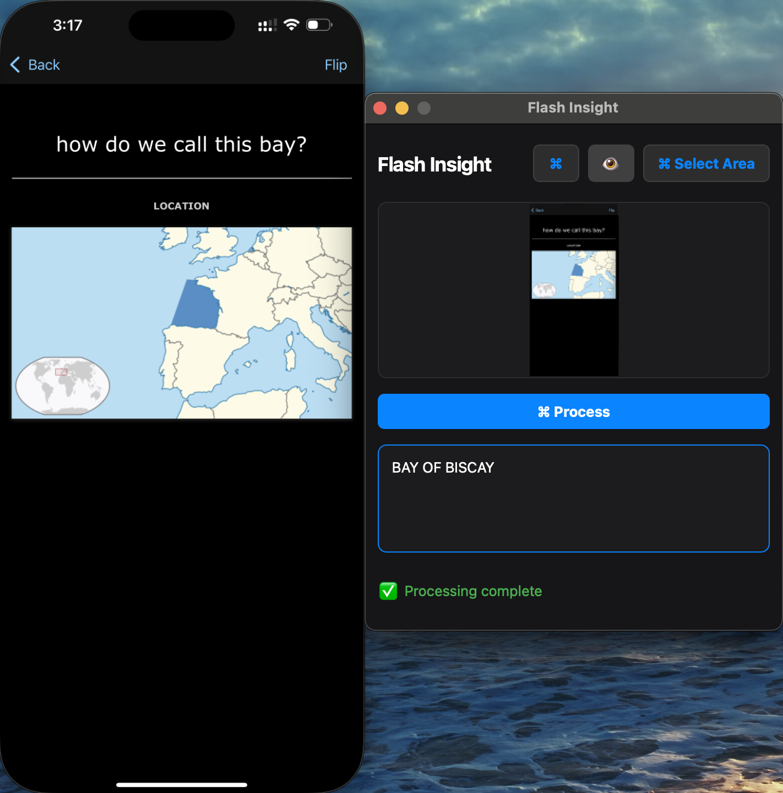

# Flash Insight 📸

Real-time visual AI processing at your fingertips. Flash Insight instantly analyzes screen content using Google's Gemini Vision AI, providing immediate, accurate insights from any visual information.

## Overview

Flash Insight combines advanced computer vision with real-time screen capture to transform visual information into instant understanding. Built with PyQt5 and Gemini Vision AI, it offers a clean, efficient interface for rapid visual analysis.


*Flash Insight shown alongside an iPhone screen mirror, demonstrating real-time quiz analysis and answer processing.*

## Features

- 📸 Real-time preview of capture area
- 🎯 Adjustable capture region
- 🤖 AI-powered content analysis using Google's Gemini
- 🖥️ Clean, modern interface
- ⚡ Fast and responsive processing
- 🔝 Always-on-top window for easy access

## 🚀 Getting Started

### Prerequisites
- Python 3.8+
- Google Gemini API key (free tier available)

## Installation

1. Clone the repository
```bash
git clone https://github.com/JadAssaf/flash-insight.git
cd flash-insight
```

2. Install dependencies
```bash
pip install -r requirements.txt
```

3. Create a `.env` file and add your Google API key:
```bash
echo "GOOGLE_API_KEY=your_api_key_here" > .env
```
> **Note:** You can get your Google API key from [here](https://console.cloud.google.com/apis/credentials).

## Usage

Launch the application:
```bash
python flash-insight.py
```

The interface provides precise controls for capture area adjustment and real-time preview of the analyzed region.

## Configuration

Configure the model and generation parameters in `config.py`

### Model Selection
```python
MODEL_NAME = 'gemini-2.0-flash'  # Default: Fast responses
```
Available models:
- `gemini-2.0-flash`: Standard fast model for quick responses
- `gemini-2.0-flash-lite`: Lighter version of Flash, potentially faster but may be less capable
- `gemini-2.0-pro-exp-02-05`: Experimental Pro version with potential improvements
- `gemini-2.0-flash-thinking-exp-01-21`: Experimental Flash model with enhanced thinking capabilities

Check [Google AI Studio](https://aistudio.google.com) for the most up-to-date model options, as available models may change over time.

### Generation Settings
The behavior of the AI can be customized through these settings in `GENERATION_CONFIG`:

```python
GENERATION_CONFIG = {
    "temperature": 0.1,        # Controls response randomness (0.0 - 1.0)
    "candidate_count": 1,      # Number of responses to generate
    "max_output_tokens": 20,   # Maximum response length
}
```

#### Temperature (0.0 - 1.0)
- **Low (0.0 - 0.3)**: More precise, consistent answers
  - Best for: Quiz answers, factual responses
  - Default: 0.1
- **Medium (0.4 - 0.6)**: Balanced between consistency and creativity
  - Best for: General purpose use
- **High (0.7 - 1.0)**: More creative, varied responses
  - Best for: Creative writing, brainstorming

#### Candidate Count
- Controls how many different answers the model generates
- Higher values = more options but increased API usage
- Default: 1 (single best answer)

#### Max Output Tokens
- Controls response length
- 20 tokens ≈ 15-20 words
- Increase for longer explanations
- Decrease for more concise answers

### Example Configurations

1. **For Detailed Explanations**
```python
GENERATION_CONFIG = {
    "temperature": 0.3,
    "candidate_count": 1,
    "max_output_tokens": 50,
}
```

2. **For Creative Responses**
```python
GENERATION_CONFIG = {
    "temperature": 0.7,
    "candidate_count": 1,
    "max_output_tokens": 30,
}
```

3. **For Multiple Answer Suggestions**
```python
GENERATION_CONFIG = {
    "temperature": 0.5,
    "candidate_count": 3,
    "max_output_tokens": 20,
}
```

### Prompt Engineering

The system prompt in `config.py` can be modified to alter the AI's interpretation and response patterns. Consider:
- Response formatting
- Analysis parameters
- Question type handling
- Context specifications


## License

MIT License - feel free to use and modify as needed!
